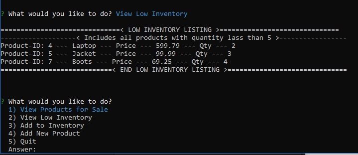

# Bamazon

# Description:
Bamazon is a basic node app storefront that uses inquirer to collect input from Customers or Managers and executes basic POS commands to a backend MySQL database. Functions supported include:

## Customer Commands
* Purchase an Item - Allows purchase of items from inventory
* Quit - gracefully exist console

## Manager Commands
* View Products for Sale - Display complete list of products onhand with quantities
* View Low Inventory - Display list of low inventory items (onhand qty less than 5)
* Add to Inventory - Add inventory to the database 
* Add New Product - Add new products to inventory
* Quit - gracefully exit console

# Important Setup Notes

## MySQl Database
This application requires a MySQL database to be set up. The schema for the database is provided in GitHub and contains a small sample set of data that can be used to start the application. IMPORTANT - To see Bamazon in action you will need to download the code and provide your own MySQL access key. Update the file bamazon_db_connect.js with your key. Also note there is one of these connect files in each of the Customer and Manager folders.

# Requirements and Technology Used:
  dependencies include: 
  - inquirer
  - MySQL - IMPORTANT - To see Bamazon in action you will need to download the code and provide your own database and MySQL access key.
  
# Screenshots of Supported Commands:

### Customer - Purchasing a Product
This image demonstrates a customer successfully completing a purchase of a product:

### Manager - Viewing all Products Onhand
This image demonstrates a Manager view of all products that are currently in the inventory.:

### Manager - Viewing Low Inventory
This image demonstrates a Manager viewing all items in inventory that have a quantity of less than 5 onhand:

### Manager - Adding to Inventory
This image demonstrates a Manager adding quantity to a specific product in the inventory:

### Manager - Adding a New Product
This image demonstrates a Manager adding a new product to inventory:

# Remaining Tasks
- [ ] Overall - need to use environment variable for MySQL key 
- [ ] Overall - improve display back to user
- [ ] Overall - code can be much dryer
- [ ] Manager - validation - need to check for duplicates when adding new product
- [ ] Supervisor command need to be developed
